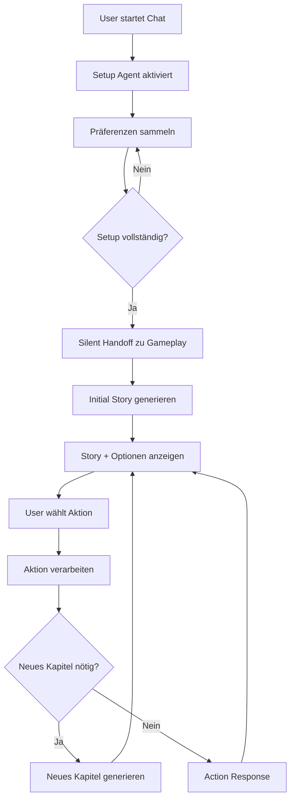

# TextRPG - Generatives TextRPG mit AI-Agenten

Ein **modernes TextRPG-System** mit generativen Geschichten, das auf einem **2-Agent-System** mit nahtlosen Übergängen basiert. Das System nutzt **LangGraph** für intelligente Agent-Orchestrierung und **FastAPI + React** für eine reaktionsschnelle Chat-Experience.

## 🎯 Projektübersicht

**TextRPG** kombiniert klassische Text-Rollenspiele mit modernster AI-Technologie:

- **Setup Agent**: Sammelt Spielerpräferenzen und erstellt den initialen Spielrahmen
- **Gameplay Agent**: Generiert dynamische Geschichten und verwaltet Spielmechaniken
- **Silent Handoffs**: Nahtlose Agent-Übergänge ohne sichtbare System-Transitionen
- **Streaming Interface**: Echtzeit-Textausgabe für immersive User Experience

## 🏗️ Architektur

### Backend (FastAPI + LangGraph)
```
backend/app/
├── agents/              # AI-Agent Implementierungen
│   ├── setup_agent.py   # Character Creation & Onboarding
│   └── gameplay_agent.py # Story Generation & Game Logic
├── graph/               # LangGraph Workflow Management
│   ├── workflow.py      # Agent-Orchestrierung
│   └── session_manager.py # Session & State Management
├── models/              # Pydantic Data Models
├── routes/              # FastAPI REST + SSE Endpoints
├── services/            # LLM & External Services
└── prompts/             # Agent-Prompt Definitionen
```

### Frontend (React + TypeScript)
```
frontend/src/
├── components/          # UI Components
│   ├── ChatContainer.tsx # Haupt-Chat Interface
│   ├── MessageList.tsx   # Nachrichten-Historie
│   └── MessageInput.tsx  # User-Input Handling
├── hooks/               # Custom React Hooks
│   └── useChat.ts       # Chat State & SSE Logic
├── services/            # API Communication
└── types/               # TypeScript Definitionen
```

## 🚀 Features

### ✅ Implementiert
- **2-Agent System**: Setup + Gameplay Agents mit Command-basierten Übergängen
- **Streaming Chat**: Server-Sent Events für Echtzeit-Textausgabe
- **Session Management**: Persistente Chat-Sessions mit State-Management
- **Story Generation**: Kontextuelle Geschichten mit unterschiedlichen Längen:
  - Initial-Kapitel: 600-800 Wörter
  - Folge-Kapitel: 200-400 Wörter
  - Action-Responses: 100-200 Wörter
- **Performance Optimierung**: 20x Streaming-Performance durch Word-Chunk-Streaming

### 🔄 Setup Flow
1. **Setup Agent** sammelt Spielerpräferenzen (Genre, Schwierigkeit, Ausschlüsse)
2. **Silent Handoff** übergibt Kontext an Gameplay Agent
3. **Initial Story** wird generiert mit Handlungsoptionen
4. **Interactive Gameplay** mit dynamischen Story-Progressionen

## 🛠️ Technologie-Stack

### Backend
- **FastAPI**: REST API + Server-Sent Events
- **LangGraph**: Agent-Orchestrierung & Workflow-Management
- **LangChain**: LLM-Integration & Message-Handling
- **OpenRouter**: Multi-Model LLM Access
- **Pydantic**: Data Validation & Settings
- **Structured Logging**: Comprehensive Observability

### Frontend
- **React 19**: Modern Component-basierte UI
- **TypeScript**: Type-sichere Entwicklung
- **Vite**: Lightning-fast Build-Tool
- **TailwindCSS**: Utility-first Styling
- **Custom Hooks**: Wiederverwendbare Chat-Logik

### LLM Models (via OpenRouter)
- **Setup Agent**: Optimiert für Dialog & Datensammlung
- **Gameplay Agent**: Spezialisiert auf kreative Story-Generation

## 📋 Voraussetzungen

- **Python 3.11+**
- **Node.js 18+**
- **OpenRouter API Key**

## ⚡ Quick Start

### 1. Repository klonen
```bash
git clone <repository-url>
cd TextRPG
```

### 2. Backend Setup
```bash
cd backend
python -m venv venv
source venv/bin/activate  # Windows: venv\Scripts\activate
pip install -r requirements.txt
```

### 3. Environment Configuration
Erstelle `.env` im Root-Verzeichnis:
```env
OPENROUTER_API_KEY=your_key_here
LLM_DEFAULT=google/gemini-2.0-flash-exp
LLM_SETUP=google/gemini-2.0-flash-exp
LLM_GAMEPLAY=google/gemini-2.5-flash-preview-05-20
```

### 4. Frontend Setup
```bash
cd frontend
npm install
```

### 5. Development Starten
```bash
# Backend (Terminal 1)
cd backend
uvicorn app.main:app --reload --port 8000

# Frontend (Terminal 2)
cd frontend
npm run dev
```

🎮 **Zugriff**: http://localhost:5173

## 🔧 API Endpoints

### Chat & Streaming
- `GET /chat/stream` - SSE Streaming Chat
- `GET /chat/session/{id}` - Session Info & Historie
- `POST /chat/session` - Neue Session erstellen
- `DELETE /chat/session/{id}` - Session löschen

### Health & Debug
- `GET /health` - System Health Check
- `GET /test-llm` - LLM Service Test
- `GET /sessions` - Alle aktiven Sessions

## 🎮 Gameplay Flow



## 🧪 Testing

### System Tests
```bash
# Vollständige Integration Tests
python test_integration.py

# Live System Tests
python test_live_system.py

# Setup Tests
python test_setup_complete.py
```

### Frontend Development
```bash
cd frontend
npm run type-check  # TypeScript Validation
npm run lint        # ESLint
npm run build       # Production Build
```

## 📊 Performance Metriken

- **Streaming Performance**: 80+ Wörter/Sekunde (20x Optimierung)
- **First Response Time**: < 2 Sekunden
- **Agent Transition Time**: < 500ms (Silent Handoffs)
- **Setup Completion**: ≤ 4 User-Interaktionen

## 🔍 Debugging

### Development Features
- **Debug Panel**: Live-Informationen über Session, Agent, Status
- **Structured Logging**: Comprehensive Backend-Logs
- **Connection Testing**: Frontend-Backend Connectivity Check
- **LangSmith Integration**: LLM-Call Tracing & Analytics

### Log-Level Configuration
```env
LOG_LEVEL=DEBUG  # DEBUG, INFO, WARNING, ERROR
LANGSMITH_TRACING=true
LANGSMITH_PROJECT=TextRPG-Development
```

## 🛡️ Konfiguration

### Agent-Konfiguration
```python
# Session Limits
MAX_CHAPTERS = 5
MAX_INTERACTIONS = 20

# Story-Längen
INITIAL_CHAPTER_WORDS = "600-800"
FOLLOW_CHAPTER_WORDS = "200-400" 
ACTION_RESPONSE_WORDS = "100-200"
```

### Frontend-Konfiguration
```typescript
// CORS & API Settings
API_BASE_URL = "http://localhost:8000"
SSE_RECONNECT_DELAY = 3000
MAX_RECONNECT_ATTEMPTS = 5
```

## 📁 Projektstruktur

```
TextRPG/
├── backend/                 # FastAPI Backend
│   ├── app/                # Application Code
│   │   ├── agents/         # AI-Agents
│   │   ├── graph/          # LangGraph Workflows
│   │   ├── models/         # Data Models
│   │   ├── routes/         # API Endpoints
│   │   └── services/       # External Services
│   └── prompts/            # Agent Prompts
├── frontend/               # React Frontend
│   ├── src/               # Source Code
│   │   ├── components/    # UI Components
│   │   ├── hooks/         # Custom Hooks
│   │   └── services/      # API Services
│   └── package.json       # Dependencies
├── project_notes/          # Documentation
│   └── prd.md             # Product Requirements
├── test_*.py              # System Tests
└── README.md              # Diese Datei
```

## 🔄 Development Workflow

### Branch-Strategie
- `master` - Production-ready Code
- `Setup-Gameplay-Agent-Architecture` - Current Development Branch
- Feature Branches für neue Features

### Code Standards
- **Backend**: Type Hints, Pydantic Models, Async/Await
- **Frontend**: TypeScript Strict Mode, Component Props, Custom Hooks
- **Commits**: Conventional Commits mit klaren Beschreibungen

## 🚀 Deployment

### Production Considerations
- Environment Variables für Secrets
- CORS-Konfiguration für Production-URLs
- Rate Limiting für API-Endpoints
- Session Persistence (aktuell In-Memory)
- Health Checks & Monitoring

## 📝 Lizenz

Dieses Projekt ist für Entwicklungszwecke erstellt. Produktive Nutzung erfordert entsprechende LLM-API-Lizenzen.

## 🤝 Contributing

1. Fork das Repository
2. Erstelle Feature Branch (`git checkout -b feature/neue-funktion`)
3. Committe Änderungen (`git commit -m 'feat: Neue Funktion hinzugefügt'`)
4. Push Branch (`git push origin feature/neue-funktion`)
5. Erstelle Pull Request

---

**Status**: 🟢 Active Development  
**Version**: MVP Phase 2 - Setup/Gameplay Agent Architecture  
**Letzte Aktualisierung**: Dezember 2024 