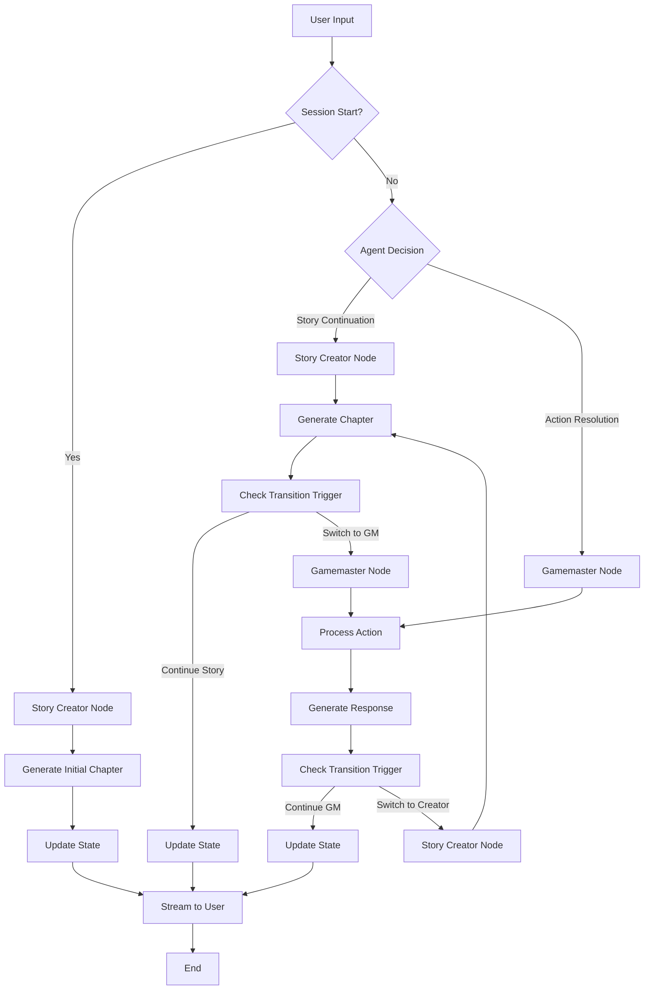

# TextRPG MVP - Vollständige Architektur

## **Projektziele**
- **Phase 1**: Funktionierender Streaming-Chatbot mit LangChain/LangGraph + OpenRouter
- **Phase 2**: Vollständiges Zwei-Agent-System (Story Creator + Gamemaster) mit automatischem Switching
- **MVP**: Einfache aber erweiterbare Basis für generatives TextRPG

## **Technischer Stack**


## **Vollständige Dateistruktur**

```
TextRPG/
├── backend/
│   ├── app/
│   │   ├── __init__.py
│   │   ├── main.py                 # FastAPI Application
│   │   ├── config.py               # Environment Configuration
│   │   ├── models/
│   │   │   ├── __init__.py
│   │   │   ├── state.py            # LangGraph State Models
│   │   │   └── chat.py             # Chat Message Models
│   │   ├── agents/
│   │   │   ├── __init__.py
│   │   │   ├── story_creator.py    # Story Creator Agent Logic
│   │   │   ├── gamemaster.py       # Gamemaster Agent Logic
│   │   │   └── prompts.py          # Agent Prompt Templates
│   │   ├── graph/
│   │   │   ├── __init__.py
│   │   │   ├── workflow.py         # LangGraph Workflow Definition
│   │   │   └── nodes.py            # LangGraph Node Functions
│   │   ├── services/
│   │   │   ├── __init__.py
│   │   │   ├── llm_service.py      # OpenRouter Integration
│   │   │   └── session_service.py  # Session Management
│   │   └── routes/
│   │       ├── __init__.py
│   │       ├── chat.py             # Chat Endpoints with Streaming
│   │       └── health.py           # Health Check
│   ├── requirements.txt
│   └── .env.example
├── frontend/
│   ├── src/
│   │   ├── components/
│   │   │   ├── ChatInterface.tsx   # Main Chat Container
│   │   │   ├── MessageList.tsx     # Message Display Component
│   │   │   ├── MessageInput.tsx    # User Input Component
│   │   │   └── ActionButtons.tsx   # Quick Action Buttons (Phase 2)
│   │   ├── services/
│   │   │   ├── api.ts              # Backend API Integration
│   │   │   └── streaming.ts        # SSE Streaming Logic
│   │   ├── types/
│   │   │   └── chat.ts             # TypeScript Type Definitions
│   │   ├── hooks/
│   │   │   └── useChat.ts          # Chat State Management Hook
│   │   ├── App.tsx                 # Main Application Component
│   │   └── main.tsx                # Application Entry Point
│   ├── package.json
│   ├── vite.config.ts
│   ├── tailwind.config.js          # Styling Configuration
│   └── index.html
├── project_notes/                  # Existing Documentation
│   ├── project_description.md
│   ├── prompt_story_creator.md
│   ├── prompt_game_master.md
│   └── mvp_architecture.md         # This file
└── README.md
```

## **Implementierungsphasen**

### **Phase 1: Foundation Chatbot**
**Ziel**: Funktionierender Streaming-Chatbot mit LangChain/LangGraph + OpenRouter

**Backend Components:**
- FastAPI mit Server-Sent Events (SSE)
- LangChain OpenRouter Integration
- Minimaler LangGraph Workflow (Ein Generic Chat Node)
- Basic State Management
- Environment Configuration

**Frontend Components:**
- React Chat Interface mit Streaming
- Message Display Component
- User Input Component  
- Session Management (Reset)

**Technical Implementation:**
```python
# Minimal LangGraph Workflow
workflow = StateGraph(ChatState)
workflow.add_node("chat", basic_chat_node)
workflow.set_entry_point("chat")
workflow.add_edge("chat", END)
```

### **Phase 2: Agents & MVP Graph**
**Ziel**: Vollständiges Zwei-Agent-System mit TextRPG Logik

**Agent Implementation:**
- Story Creator Agent mit vollständigem Prompt aus `prompt_story_creator.md`
- Gamemaster Agent mit vollständigem Prompt aus `prompt_game_master.md`
- Agent-spezifische LLM Models (LLM_CREATOR, LLM_GAMEMASTER)
- Transition Logic zwischen Agents

**Advanced LangGraph:**
- Conditional Routing zwischen Agents
- Agent Context Handoff
- Enhanced State Persistence
- Automatic Agent Switching

## **Kernkomponenten - Detailspezifikation**

### **State Management**

```python
# models/state.py
from typing import List, Optional, Dict, Literal
from pydantic import BaseModel
from langchain_core.messages import BaseMessage

class ChatState(BaseModel):
    # Session Management
    session_id: str
    messages: List[BaseMessage]
    
    # Agent System (Phase 2)
    current_agent: Optional[Literal["story_creator", "gamemaster"]] = None
    story_context: Optional[str] = None
    character_info: Optional[Dict] = None
    world_state: Optional[Dict] = None
    transition_trigger: Optional[str] = None
    agent_handoff_context: Optional[str] = None
    
    # Metadata
    created_at: Optional[str] = None
    last_updated: Optional[str] = None
```

### **LLM Service Configuration**

```python
# services/llm_service.py
from langchain_openai import ChatOpenAI
from config import settings

class LLMService:
    def __init__(self):
        self.base_config = {
            "base_url": "https://openrouter.ai/api/v1",
            "api_key": settings.openrouter_api_key,
            "streaming": True,
            "temperature": 0.7
        }
    
    def get_default_llm(self):
        return ChatOpenAI(model=settings.llm_default, **self.base_config)
    
    def get_creator_llm(self):
        return ChatOpenAI(model=settings.llm_creator, **self.base_config)
    
    def get_gamemaster_llm(self):
        return ChatOpenAI(model=settings.llm_gamemaster, **self.base_config)
```

### **Agent Architecture**

#### **Story Creator Agent**
```python
# agents/story_creator.py
class StoryCreatorAgent:
    def __init__(self):
        self.llm = llm_service.get_creator_llm()
        # Load prompt from prompt_story_creator.md
        with open("project_notes/prompt_story_creator.md", "r") as f:
            self.system_prompt = f.read()
    
    def generate_chapter(self, messages, context: dict) -> tuple[str, bool]:
        """Generate story chapter and determine if transition needed"""
        # Implementation with prompt integration
        
    def _should_transition_to_gamemaster(self, response: str) -> bool:
        """Detect transition triggers from story creator prompts"""
        transition_indicators = [
            "--- HANDLUNGSOPTIONEN ---",
            "What do you do?",
            "How do you respond?"
        ]
        return any(indicator in response for indicator in transition_indicators)
```

#### **Gamemaster Agent**
```python
# agents/gamemaster.py  
class GamemasterAgent:
    def __init__(self):
        self.llm = llm_service.get_gamemaster_llm()
        # Load prompt from prompt_game_master.md
        with open("project_notes/prompt_game_master.md", "r") as f:
            self.system_prompt = f.read()
    
    def process_action(self, messages, context: dict) -> tuple[str, bool]:
        """Process player action and determine if transition needed"""
        # Implementation with prompt integration
        
    def _should_transition_to_story_creator(self, response: str) -> bool:
        """Detect transition triggers from gamemaster prompts"""
        transition_indicators = [
            "--- STORY CREATOR ÜBERGANG ---",
            "major plot development",
            "new chapter needed"
        ]
        return any(indicator in response for indicator in transition_indicators)
```

### **LangGraph Workflow Design**



### **Frontend Streaming Integration**

```typescript
// services/streaming.ts
export async function* streamChat(message: string, sessionId?: string): AsyncGenerator<StreamResponse> {
  const response = await fetch('/api/chat/stream', {
    method: 'POST',
    headers: { 'Content-Type': 'application/json' },
    body: JSON.stringify({ message, session_id: sessionId }),
  });

  const reader = response.body?.getReader();
  const decoder = new TextDecoder();

  while (true) {
    const { done, value } = await reader.read();
    if (done) break;

    const chunk = decoder.decode(value);
    const lines = chunk.split('\n');

    for (const line of lines) {
      if (line.startsWith('data: ')) {
        const data = line.slice(6);
        if (data === '[DONE]') return;
        
        try {
          const parsed: StreamResponse = JSON.parse(data);
          yield parsed;
        } catch (e) {
          yield { content: data };
        }
      }
    }
  }
}
```

## **API Endpoints**

### **Chat API**
```
POST /api/chat/stream
- Body: { "message": string, "session_id"?: string }
- Response: Server-Sent Events Stream
- Content-Type: text/plain

POST /api/chat/reset
- Response: { "status": "session_reset" }

GET /api/health
- Response: { "status": "healthy" }
```

## **Environment Configuration**

```env
# .env.example
OPENROUTER_API_KEY=your_openrouter_api_key_here
LLM_DEFAULT=google/gemini-2.0-flash-exp
LLM_CREATOR=google/gemini-2.0-flash-exp
LLM_GAMEMASTER=google/gemini-2.5-flash-preview-05-20
```

## **Dependencies**

### **Backend Requirements**
```txt
fastapi==0.104.1
uvicorn[standard]==0.24.0
langchain==0.1.0
langchain-openai==0.0.2
langgraph==0.0.20
pydantic==2.5.0
pydantic-settings==2.1.0
python-multipart==0.0.6
python-dotenv==1.0.0
```

### **Frontend Dependencies**
```json
{
  "dependencies": {
    "react": "^18.2.0",
    "react-dom": "^18.2.0",
    "uuid": "^9.0.1"
  },
  "devDependencies": {
    "@types/react": "^18.2.43",
    "@types/react-dom": "^18.2.17",
    "@types/uuid": "^9.0.7",
    "@vitejs/plugin-react": "^4.2.1",
    "autoprefixer": "^10.4.16",
    "postcss": "^8.4.32",
    "tailwindcss": "^3.3.6",
    "typescript": "^5.2.2",
    "vite": "^5.0.8"
  }
}
```

## **Erweiterungsmöglichkeiten (Post-MVP)**

### **UI/UX Enhancements**
- Markdown Rendering für formatierte Texte
- Action Button System aus Gamemaster-Optionen
- Charakterbogen Interface
- Story Setting Wizard
- Chat History mit Suche

### **Backend Features**
- Supabase Persistierung für Spielstände
- Multi-Session Management
- Advanced Agent Logic mit Memory
- Image Generation Integration
- Audio/TTS Support

### **Deployment & Skalierung**
- Docker Container für Backend
- Supabase Backend Deployment
- Vercel/Netlify Frontend Deployment
- CI/CD Pipeline
- Monitoring & Analytics

## **Implementierungsreihenfolge**

1. **Backend Foundation**: FastAPI Setup, LangChain Integration, Basic LangGraph
2. **Frontend Foundation**: React Chat Interface, Streaming Integration
3. **Agent Integration**: Story Creator und Gamemaster Implementation
4. **Agent Orchestration**: Automatic Switching, Context Handoff
5. **Testing & Polish**: End-to-End Testing, Error Handling, UI Improvements

## **Erfolgskriterien MVP**

✅ **Phase 1**: Funktionierender Streaming-Chatbot mit einem LLM  
✅ **Phase 2**: Zwei-Agent-System mit automatischem Wechsel  
✅ **Erweiterbarkeit**: Klare Architektur für zukünftige Features  
✅ **Performance**: Streaming-Responses < 2s erste Tokens  
✅ **Usability**: Einfaches Interface, Reset-Funktionalität  

---

**Architektur-Status**: Implementierungsbereit  
**Dokumentation**: Vollständig  
**Nächster Schritt**: Phase 1 Implementierung beginnen 